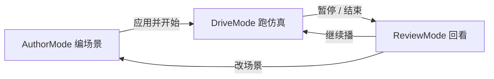
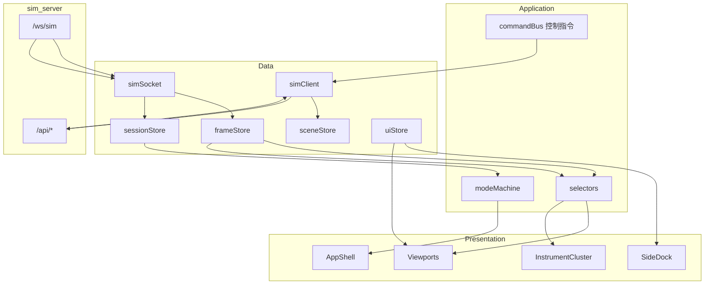

# AutoSim 前端仿真界面系统架构

> 版本：1.0  
> 日期：2026-08-08  
> 状态：设计稿（指导后续前端重构；本轮不强制改代码）  
> 范围：`web/` SPA + 与 `sim_server` 的帧/状态契约  
> 原则：**教学可讲清 + 工程可对照**，贴近实车智驾仿真台，但不做成完整 CarMaker / CARLA 套件。

---

## 1. 背景与目标

### 1.1 现状问题

当前界面（`App` + 顶栏按钮条 + 鸟瞰 Canvas + 右侧场景编辑 + 浮动 HMI）已能跑通教学闭环，但对「真实开发中的仿真台」而言过于扁平：

| 现状 | 问题 |
|------|------|
| 单视口 BEV | 无法同时看控制预览、感知叠加、纵向仪表 |
| 顶栏塞满按钮 | 驾驶操作 / 教学模式 / 回放控制混在一起 |
| HUD 多为文本 | 缺少仪表簇、通道条、告警等级可视化 |
| 图层不可关 | 感知/预测/路径叠在一起难对比 |
| 调试面薄 | 无模块 Inspector、无链路延迟/帧健康 |
| 场景编辑与运行态同屏抢位 | 编场景时像 CAD，跑仿真时像玩具 |

### 1.2 设计目标

1. **一眼可读驾驶态势**：速度、AD 状态、AEB/TOR、横向误差、跟车间隙。  
2. **分层可调试**：地图 / 规划 / 感知 / 控制各自可开关、可检视。  
3. **工作区可切换**：Author（编场景）↔ Drive（跑仿真）↔ Review（回看分析）。  
4. **契约稳定**：后端 `Snapshot` / `Status` 渐进扩展，前端按域消费，避免再堆巨型 `App.tsx`。  
5. **教学友好**：默认布局「少而清」；高级面板折叠，不吓退初学者。

### 1.3 非目标（刻意不做）

- 真 3D 引擎渲染（Unreal / Three.js 全场景）——可作为远期可选视口，非 P0。  
- 多车协同联调台、云端大规模 scenario farm UI。  
- 完整 ISO 26262 HMI 认证套件。  
- 重写后端消息总线为 Protobuf（文档预留扩展位即可）。

---

## 2. 用户角色与工作模式



| 模式 | 主任务 | 主视口 | 右侧默认面板 |
|------|--------|--------|--------------|
| **Author** | 底图算路、路段、障碍、教学开关 | 世界坐标系地图编辑 | Scene Studio |
| **Drive** | 激活 AD、拨杆、双手、观察闭环 | Ego 跟随 BEV + 仪表 | Mission / Layers（轻） |
| **Review** | Seek、对比帧、查 HMI 与通道 | BEV + 通道曲线 | Inspector + Event Log |

模式由前端根据 `status.status` / `scrubbing` / 用户显式切换推导；Author 在 `idle` 或用户点「编辑场景」时进入。

---

## 3. 信息架构（IA）与布局

### 3.1 目标线框（桌面 ≥1280px）

```
┌─ ShellHeader ──────────────────────────────────────────────────────────┐
│ Brand · ModeTabs(Author|Drive|Review) · ConnectionPill · SimClock     │
├─ TransportBar ─────────────────────────────────────────────────────────┤
│ ◀ ▶ ⏯ · TimelineScrubber ════════════ · Frame i/N · Rate 1x          │
├─ Workspace ────────────────────────────────────────────────────────────┤
│ ┌─ ViewportHost ──────────────────────────┐ ┌─ SideDock ────────────┐ │
│ │  Primary: BirdEye (BEV)                 │ │ Tab: Mission          │ │
│ │  ┌──────┐  ┌──────────┐                 │ │ Tab: Layers           │ │
│ │  │Cluster│ │MiniMap   │  (PIP 可关)     │ │ Tab: Scene            │ │
│ │  └──────┘  └──────────┘                 │ │ Tab: Inspector        │ │
│ │  Overlay: SafetyBanner / ToastStack     │ │ Tab: Events           │ │
│ └─────────────────────────────────────────┘ └───────────────────────┘ │
├─ ChannelStrip（可折叠）────────────────────────────────────────────────┤
│ speed | v_cmd | accel | steer | d_gap | TTC | hands_off | lat_err     │
└────────────────────────────────────────────────────────────────────────┘
```

### 3.2 布局原则

1. **驾驶操作与场景编辑分离**：拨杆 / 激活 / TOR 放在 Drive 区或方向盘式快捷条，不与「加路段」混排。  
2. **主视口永远是态势**：BEV 占最大面积；仪表与迷你图是 PIP，不抢主叙事。  
3. **SideDock 用 Tab，不用无限变长单页**：Scene / Layers / Inspector / Events 互斥或双开（双开仅宽屏）。  
4. **告警有独立层级**：FCW/AEB/TOR 用 `SafetyBanner` 全宽条，不再只靠左上小日志。  
5. **ChannelStrip 固定底栏**：工程师扫一眼数值通道，类似示波器缩略条；展开进 Review 曲线。

### 3.3 响应式

| 宽度 | 策略 |
|------|------|
| ≥1440 | SideDock 360–420px；可双 Tab |
| 1024–1439 | SideDock 300px；Cluster 缩为条状 |
| <1024 | SideDock 抽屉；Cluster 并入底栏；编辑工具底部 sheet |

---

## 4. 前端模块架构

### 4.1 目标目录（渐进迁移，兼容现有文件）

```
web/src/
├── app/
│   ├── AppShell.tsx          # 模式 + 布局骨架
│   ├── modeMachine.ts        # Author|Drive|Review
│   └── hotkeys.ts
├── data/
│   ├── simClient.ts          # REST（现 api.ts）
│   ├── simSocket.ts          # WS 帧/状态
│   ├── stores/               # 或 React context 分域
│   │   ├── frameStore.ts     # Snapshot
│   │   ├── sessionStore.ts   # Status / transport
│   │   ├── sceneStore.ts     # draft / applied
│   │   └── uiStore.ts        # layers / dock / mode
│   └── selectors.ts          # 派生：lat_err、ttc 展示等
├── layout/
│   ├── ShellHeader.tsx
│   ├── TransportBar.tsx
│   ├── ViewportHost.tsx
│   ├── SideDock.tsx
│   └── ChannelStrip.tsx
├── viewports/
│   ├── BirdEyeViewport.tsx   # 现 BirdEyeCanvas 拆出绘制核心
│   ├── layers/               # 图层绘制插件
│   │   ├── mapLayer.ts
│   │   ├── routeLayer.ts
│   │   ├── perceptionLayer.ts
│   │   ├── predictionLayer.ts
│   │   ├── planningLayer.ts
│   │   ├── controlLayer.ts
│   │   └── egoLayer.ts
│   └── MiniMap.tsx
├── cluster/
│   ├── InstrumentCluster.tsx # 速度 / 限速 / AD 灯
│   ├── AdasIcons.tsx         # LCC ACC AEB FCW TOR
│   └── HandsOffMeter.tsx     # 现进度条升级
├── hmi/
│   ├── SafetyBanner.tsx
│   ├── ToastStack.tsx
│   └── EventLog.tsx          # 现 HmiPanel 日志部分
├── docks/
│   ├── MissionDock.tsx       # AD 操作、拨杆、教学开关
│   ├── LayersDock.tsx
│   ├── SceneDock.tsx         # 现 ConfigPanel
│   └── InspectorDock.tsx     # 模块 JSON / 关键字段
├── review/
│   ├── Timeline.tsx
│   └── ChannelCharts.tsx     # 可选 P2
├── scene/
│   └── sceneEdit.ts
├── theme/
│   ├── tokens.css            # 从 styles.css 抽变量
│   └── glyphs.ts
└── types/
    └── sim.ts                # 现 types.ts
```

迁移策略：**先加壳不改画布** → 再拆图层 → 再上仪表与 Banner → 最后拆 store。避免一次性重写 `BirdEyeCanvas.tsx`。

### 4.2 逻辑分层



### 4.3 关键子系统职责

| 子系统 | 职责 | 输入 | 输出 |
|--------|------|------|------|
| **simSocket** | 帧泵、断线重连、可选背压（只留最新帧） | WS `frame`/`status` | stores |
| **modeMachine** | Author/Drive/Review | status + 用户意图 | 布局可见性 |
| **ViewportHost** | 主视口 + PIP 槽位 | frame + layerFlags | 绘制 |
| **LayerRegistry** | 注册/排序/开关图层 | uiStore.layers | paint 列表 |
| **InstrumentCluster** | 车速、限速、AD 灯、ADAS 图标 | selectors(frame,status) | SVG/Canvas UI |
| **SafetyBanner** | FCW/AEB/TOR 全宽告警 | hmi.highest / aeb / tor | 横幅 |
| **MissionDock** | 激活、拨杆、双手、Leads 开关 | status.can_* | `postControl` |
| **SceneDock** | 场景编辑（现 ConfigPanel） | sceneStore | `putScene` |
| **InspectorDock** | 只读结构化字段 | frame 切片 | 表格/JSON |
| **ChannelStrip** | 关键标量实时条 | selectors | 迷你条 + sparkline |
| **commandBus** | 统一热键与按钮 → action | UI 事件 | REST control |

---

## 5. 视口与图层系统

### 5.1 视口类型（P0–P2）

| ID | 名称 | P0 | 说明 |
|----|------|----|------|
| `bev` | 鸟瞰主视口 | 必选 | Ego-follow / 世界编辑两相机模式（已有） |
| `cluster` | 仪表 PIP | 必选 | 非独立大窗，叠在 BEV 左下 |
| `minimap` | 全局小地图 | 建议 | 显示全路线与自车；点击可「看全局」 |
| `camera_front` | 前视相机假图 | P2 | 用 Canvas 伪相机或简单投影，教学用 |
| `charts` | 通道图 | P2 | Review 模式底栏展开 |

### 5.2 图层清单（BEV）

| Layer ID | 默认 Drive | 默认 Author | 数据源 |
|----------|------------|-------------|--------|
| `map.network` | on | on | `network_lane_markings` |
| `map.junctions` | on | on | `junctions` |
| `route.nav` | on | on | `route_links` / 导航高亮 |
| `plan.path` | on | off | `path` |
| `plan.nudge` | on | off | `nudge` + path 样式 |
| `plan.lane_change` | on | off | `lane_change` |
| `ctrl.pp_preview` | on | off | `preview_traj` / lookahead |
| `perc.fused` | on | off | `fused` |
| `perc.truth_obstacles` | dim | on | `obstacles` |
| `pred.traj` | on | off | `predictions` |
| `ego.truth` | on | on | `vehicle` |
| `ego.est` | teach | off | `vehicle_est` |
| `ego.trail` | on | off | 前端环形缓冲 |
| `debug.grid` | off | on | 本地 |
| `debug.ids` | off | off | obs / track id |

图层状态进 `uiStore`，并 `localStorage` 持久化（按 mode 各存一份）。

### 5.3 绘制管线

```
WS frame → frameRef.current = snapshot   // 不 setState、不触发 React re-render
    → BirdEyeViewport rAF loop
    → camera ← zoom/pan/size refs（本帧组装）
    → frameData ← frameRef + 编辑侧 refs 的原始引用（禁止预处理/裁剪/派生新 scene）
    → paint(ctx, camera, frameData, layerFlags)
         └─ 函数内按 layerFlags 决定是否画各层
    → overlays（SafetyBanner 等用 DOM，不在 canvas 内）
```

**强制技术约束：**

1. **渲染隔离**  
   `BirdEyeViewport` 必须使用 `useRef` + `requestAnimationFrame` 循环绘制。  
   仿真帧到达时只写 `frameRef.current = snapshot`，**严禁**因帧数据调用 `setState` 或导致该视口 React re-render。  
   编辑态/图层开关等低频 UI 变更可通过 props→ref 同步；高频位姿流不得走 React 渲染路径。

2. **绘制纯函数**  
   图层（及 P-UI0 合并绘制入口）签名固定为：

   ```ts
   paint(ctx: CanvasRenderingContext2D, camera: Camera, frameData: FrameData, layerFlags: LayerFlags): void
   ```

   - `paint` **只**接收上述四参；在函数内部实时读 `layerFlags` 决定是否画线/画盒。  
   - **不得**在调用 `paint` 前预处理 `frameData`（禁止滤掉障碍、预拼 path、预计算可见集等）。  
   - 派生量（如 trail 环形缓冲）若需要，在 `paint` 内或视口私有 ref 中维护，不改写传入的 `frameData` 语义。

3. **事件穿透**  
   `ViewportHost` 必须监听 SideDock 的鼠标移入/移出，动态设置 BEV Canvas 容器的 `pointer-events`：  
   Dock 悬停 → `pointer-events: none`（面板操作不拖动画布）；离开 Dock → 恢复 `auto`。

其它要求：

- **Camera 与 Layer 解耦**：缩放/平移只改 camera / 其 refs，图层只读。  
- **Author / Drive 相机策略切换**集中在 `BirdEyeViewport`，不要散落在 App。  
- 单帧绘制预算：目标 60fps；图层内避免分配大数组（复用 path 缓冲）。

---

## 6. 仪表簇与安全 HMI

### 6.1 Instrument Cluster（P0）

面向「驾驶席扫一眼」，不是游戏 HUD 堆字。

| 区块 | 内容 |
|------|------|
| 中心 | 车速数字 + 单位；环状或弧形限速对比（`speed` vs `speed_limit` / `v_cmd`） |
| AD 灯带 | OFF / PASSIVE / STANDBY / ACTIVE / OVERRIDE 色点 + 文案 |
| ADAS 图标行 | LCC · ACC · AEB · FCW · Nudge · HandsOff（亮/灰/闪） |
| 次级 | 横向误差（m）、`d_gap`、TTC、steer 归一化条 |

数据尽量用现有 Snapshot 字段；缺的用 selector 估算（如 lat_err：车到 `path` 的投影距离，可前后端约定后下沉）。

### 6.2 SafetyBanner（P0）

| 等级 | 触发 | 表现 |
|------|------|------|
| info | 限速切换、变道完成 | 底色弱、3–5s |
| warn | FCW、脱手告警、变道拒绝 | 琥珀条 + 图标 |
| alert | AEB、TOR、长时间脱手 | 红条 + 脉冲；可半透明压主视口顶 |

与 `HmiPanel` 关系：Banner 只显示**当前最高优先级**；完整历史进 Events Tab。

### 6.3 Mission 操作条（Drive）

从顶栏迁出，放入 SideDock → Mission 或主视口底边「驾驶员条」：

- 激活 / 退出  
- 左变道 / 右变道  
- 请求接管 / 接管(OVERRIDE)  
- 双手在环  
- Leads 真值·感知、横向真值·估计（教学，二级折叠）

顶栏只保留：Mode · 连接 · 时钟 · 精简 Transport。

---

## 7. SideDock 面板设计

### 7.1 Mission

- AD 状态卡 + 可执行动作（尊重 `can_*`）  
- 当前车道 / 变道状态 / nudge  
- 教学开关（折叠）

### 7.2 Layers

- 分组 checkbox（地图 / 感知 / 规划 / 控制 / 调试）  
- 「教学对比」预设：一键「只看真值障碍」「只看融合」「规划+控制」

### 7.3 Scene（现 ConfigPanel）

- 仅 Author 默认置顶；Drive 中改为只读摘要 +「回到编辑」  
- 保持预设、算路、障碍、教学闭环字段

### 7.4 Inspector

只读、按模块折叠：

```
ego.vehicle / vehicle_est
planning.path_meta / acc / lane_change / nudge
safety.aeb / dms
perception.fused_count / pred_count
flags.use_truth_leads / use_est_pose_lateral
```

支持「复制 JSON」便于写 bug 报告。

### 7.5 Events

现 `HmiPanel` 日志升级：时间、level、code、msg；可按 code 过滤；点击跳转 Review seek（若该帧已录）。

---

## 8. 数据契约与扩展

### 8.1 保持兼容

继续以 JSON `Snapshot` + `StatusPayload` 为唯一实时契约（见 `web/src/types.ts`）。前端不得假设字段齐全，selector 给默认值。

### 8.2 建议增量字段（后端可分批加）

| 字段 | 用途 | 优先级 |
|------|------|--------|
| `metrics.lat_err_m` | 仪表横向误差 | P0 |
| `metrics.yaw_err_rad` | 控制调试 | P1 |
| `metrics.ttc` / 复用 `aeb.ttc` | 通道条 | P0（已有则 selector） |
| `perf.frame_dt_ms` / `ws_lag_ms` | 连接健康 | P1 |
| `modules.*.debug` | Inspector 扩展 | P2 |
| `view.camera` 枚举 | 多相机 | P2 |

### 8.3 控制面

`POST /api/control` 保持 action 枚举扩展；前端 `commandBus` 映射：

```
hotkey / button → { action, payload } → postControl → status(+frame)
```

禁止各组件直接 `fetch` 散落（逐步收敛到 `simClient`）。

### 8.4 帧性能

- WS 回调只 `setSnapshot` 最新帧；Review seek 走 REST。  
- 可选：`requestAnimationFrame` 合并同一帧内的 status+frame。  
- ChannelStrip sparkline：前端 ring buffer（如 300 点），不要求后端存曲线。

---

## 9. 视觉与交互语言

延续现有暗色工程风（`--bg0/1/2`、`--accent`、`--accent-2`、`--danger`），并约束：

1. **主视口冷色道路，强调色留给 AD/安全**（ACTIVE 薄荷、告警琥珀/红）。  
2. **Cluster 用扁平几何，不做成游戏赛车表**。  
3. **密度分级**：Drive 默认隐藏 Inspector；Review 默认打开 Events + ChannelStrip。  
4. **动效克制**：Banner 脉冲、AD 灯切换即可；不做大面积粒子。  
5. **中文优先**，关键 code 旁注英文缩写（FCW/AEB/TOR）便于对照论文/实车。

---

## 10. 与后端 / 教学模块的映射

| 教学模块 | 界面落点 |
|----------|----------|
| LaneMap / LCC | BEV `map.*` + `plan.path` |
| 拨杆变道 | Mission + BEV LC 层 + Events |
| ACC | Cluster 跟车间隙 + ChannelStrip `d_gap`/`v_cmd` |
| AEB/FCW | SafetyBanner + Cluster 图标 + `safety.aeb` |
| 感知闭环 | Layers 预设 + Leads 开关 + fused/pred 层 |
| Nudge 仲裁 | BEV nudge 层 + Events「中断绕障」 |
| DMS | HandsOffMeter + Banner |
| TOR/OVERRIDE | Banner + Mission + AD 灯 |

这样前端架构直接服务「模块课表」，而不是通用 IDE 堆砌。

---

## 11. 分阶段落地路线

### P-UI0 — 壳与信息架构（不改绘制语义）

- `AppShell` + ModeTabs + TransportBar 抽离  
- 顶栏瘦身；Mission 操作进 SideDock  
- SafetyBanner 承接 AEB/TOR  
- 验收：旧快捷键仍可用；pytest 无关；手测主流程不回退  

### P-UI1 — 仪表与通道

- InstrumentCluster PIP  
- ChannelStrip（speed/v_cmd/accel/steer/d_gap/ttc/hands_off）  
- HandsOff 进度条并入 Cluster  
- 验收：Drive 模式 3 秒内读出速度与 AD 状态  

### P-UI2 — 图层系统

- 拆 `BirdEyeCanvas` 绘制为 `layers/*`  
- LayersDock + 教学对比预设  
- 验收：可单独关闭预测/融合做感知课演示  

### P-UI3 — Inspector + Review

- InspectorDock  
- Events 可过滤；Channel sparkline  
- 可选 `metrics.lat_err_m` 后端字段  
- 验收：Review seek 时 Inspector 与 BEV 一致  

### P-UI4 — 增强视口（可选）

- MiniMap  
- 前视伪相机  
- 布局预设导入导出（JSON）

每阶段保持：**可演示、可回滚、不打断 Python 仿真主链路**。

---

## 12. 质量要求

| 项 | 要求 |
|----|------|
| 帧延迟体感 | 本机 WS 交互 < 100ms 可感延迟 |
| 绘制 | Drive 模式常开图层下保持流畅（目标 60fps @1080p） |
| **渲染隔离** | `BirdEyeViewport`：`useRef` + `requestAnimationFrame`；帧更新只改 `ref.current`，**禁止**因仿真帧触发该视口 React re-render |
| **绘制纯函数** | `paint(ctx, camera, frameData, layerFlags)`；内部按 `layerFlags` 开关图层；**禁止**调用前预处理 `frameData` |
| **事件穿透** | `ViewportHost` 根据 SideDock 悬停切换 Canvas `pointer-events`，避免右栏操作干扰 BEV 视角 |
| 可访问 | 关键按钮有 `title`/aria；告警不只靠颜色 |
| 测试 | 纯函数 selector / modeMachine 用 vitest 或节点单测；E2E 可选 Playwright 冒烟 |
| 文档 | 本文件 + HANDOFF「前端」小节同步阶段勾选 |

验收（P-UI0+）：React DevTools 下仿真运行时 `BirdEyeViewport` 不应随每帧更新；拖过 SideDock 时滚轮/拖拽不得移动 BEV。

---

## 13. 决策记录（ADR 摘要）

1. **为何不上一开就上 3D？** 教学核心在 BEV + 通道 + 状态机；3D 成本高、收益靠后。  
2. **为何用 DOM Banner + Canvas 态势？** 告警可读性与无障碍；路径几何仍适合 Canvas。  
3. **为何 Mode 三态而不是多窗口 IDE？** 贴合课堂节奏：先编后开再复盘。  
4. **为何 Layer 插件化？** `BirdEyeCanvas` 已近千行，必须按域拆才能继续加感知/规划课。  
5. **为何契约继续 JSON？** 与现 `sim_server` 一致；Protobuf 留到多语言/性能真成瓶颈时。

---

## 14. 附录：现网→目标 对照

| 现组件 | 目标归属 |
|--------|----------|
| `App.tsx` 顶栏按钮 | TransportBar + MissionDock |
| `App.tsx` meta 文本 | ShellHeader + Cluster + ChannelStrip |
| `Timeline.tsx` | TransportBar 内嵌 |
| `BirdEyeCanvas.tsx` | BirdEyeViewport + layers/* |
| `HmiPanel.tsx` | SafetyBanner + EventLog + ToastStack |
| `ConfigPanel.tsx` | SceneDock |
| `styles.css` | theme/tokens.css + 布局 CSS modules/分区 |
| `api.ts` / `types.ts` | data/simClient + types/sim |

---

## 15. 下一步（实现时）

1. ~~评审本架构~~ — 已通过；§5.3 / §12 三条强制约束已写入。  
2. ~~**P-UI0**~~ — ModeTabs + Transport + SideDock + SafetyBanner；`BirdEyeViewport` 渲染隔离。  
3. ~~**P-UI1**~~ — `InstrumentCluster` + `ChannelStrip` + `data/selectors.ts`。  
4. 下一步 **P-UI2**（LayersDock / `layers/*` 拆分）。  

文档结束。
