# AutoSim 学习手册

本文说明 AutoSim 教学仿真系统的模块划分、技术原理、核心处理流程与数据接口。  
读者无需具备自动驾驶或 Python 工程经验；文中专业术语统一在 **§2 术语解释** 中定义，正文首次出现时尽量给出英文对应词。

> 本文为学习文档，不是开发交接文档。交接与任务清单见 `HANDOFF.md`。

| 项目 | 说明 |
|------|------|
| 工程路径 | `PythonProject/` |
| 推荐启动 | `python run_web.py --rebuild` |
| 代码基准日期 | 2026-08-05 |

---

## 1. 阅读指南

| 目标 | 建议章节 |
|------|----------|
| 建立系统整体认识 | §3 系统总览 |
| 查阅专业术语定义 | §2 术语解释 |
| 理解单步仿真流程 | §3.4 单帧处理流水线 |
| 深入某一子系统 | §4 起各模块章节 |
| 查阅字段含义 | 各章「相关数据接口及含义」 |

### 1.1 各模块章节的统一结构

1. **架构图**：模块边界与依赖关系  
2. **技术原理**：问题定义、模型假设与算法要点  
3. **核心代码逻辑**：主要调用顺序与职责划分  
4. **相关数据接口及含义**：输入/输出字段及工程含义  

### 1.2 物理量与单位约定

| 物理量  | 符号示例                 | 单位   | 说明                      |
| ---- | -------------------- | ---- | ----------------------- |
| 位置   | \(x, y\)             | m    | 世界坐标系                   |
| 航向角  | \(\psi\) / `yaw`     | rad  | 绕竖直轴，0 表示朝向 \(+x\)      |
| 速度   | \(v\) / `speed`      | m/s  | 1 m/s = 3.6 km/h        |
| 加速度  | \(a\) / `accel`（指令） | m/s² | 纵向加速度指令；snapshot 字段为 `accel`。注意：`acc` 表示 ACC 跟车信息，不是加速度 |
| 前轮转角 | \(\delta\) / `steer` | rad  | 本工程限幅约 \(\pm 30^\circ\) |
| 仿真步长 | `DT`                 | s    | 固定为 0.05 s（20 Hz）       |

### 1.3 Python 基础对象（阅读代码所需）

| 概念 | 英文 | 在本工程中的典型用途 |
|------|------|----------------------|
| 类 | class | 封装算法实体，如 `PurePursuit`、`EKFLocalizer` |
| 字典 | dict | 结构化报文，如车辆状态 `{"x","y","yaw","speed"}` |
| 列表 | list | 有序集合，如路径点 `[(x,y), ...]`、检测列表 |

---

## 2. 术语解释

本章给出正文使用的专业术语定义。阅读后续章节时遇到未展开术语，可回查本节。

### 2.1 仿真与系统结构

| 术语 | 英文 | 定义 |
|------|------|------|
| 仿真 | Simulation | 用数值模型在离散时间上复现车辆—环境交互过程的方法。 |
| 仿真步长 | Time step (`DT`) | 相邻两帧之间的仿真时间间隔；本工程 `DT=0.05` s。 |
| 帧 | Frame | 一次完整的感知—规划—控制—积分—快照打包过程对应的离散时刻。 |
| 快照 | Snapshot | 某一帧输出给可视化/前端的结构化状态包（字典）。 |
| 编排 / 会话 | Orchestration / Session | 按固定顺序调度各功能模块的运行时对象；本工程为 `SimSession`。 |
| 自动驾驶软件栈 | AD stack | 感知、定位、预测、规划、控制、HMI 等分层软件的总称。 |
| 模块化 | Modularity | 按职责拆分子系统，通过明确接口交换数据，降低耦合。 |
| 配置项 | Configuration | 集中存放的算法参数与阈值，通常位于各包的 `config.py`。 |

### 2.2 坐标系、位姿与车辆模型

| 术语 | 英文 | 定义 |
|------|------|------|
| 世界坐标系 | World frame | 固定于场景的二维笛卡尔坐标系，单位为米。 |
| 车体坐标系 | Vehicle frame | 原点位于参考点（本工程为后轴中心），\(x\) 轴沿车头方向，\(y\) 轴指向左侧。 |
| 位姿 | Pose | 位置与姿态的合称；平面运动中通常为 \((x,y,\psi)\)。 |
| 自车 | Ego vehicle | 被控制与观测的主体车辆。 |
| 真值 | Ground truth | 仿真器内部无噪声的真实状态（上帝视角）。 |
| 估计值 | Estimate | 由定位/滤波算法得到的带不确定性状态。 |
| 自行车模型 | Bicycle model | 将四轮车辆简化为前后两轮的运动学模型，忽略侧偏与复杂轮胎力。 |
| 轴距 | Wheelbase | 前轴与后轴中心之间的距离。 |
| 后悬 | Rear overhang | 后轴中心至车尾的纵向距离。 |
| 参考路径 | Reference path | 自车车道中心线折线，作为横向跟踪与车道几何生成的基准。 |

### 2.3 地图与路径几何

| 术语 | 英文 | 定义 |
|------|------|------|
| 路段 | Link | 带折线几何与属性（如限速）的一段道路。 |
| 路线 / 导航路线 | Route | 有序 Link 序列，表示一次导航结果。 |
| 路网点 | Waypoint | 路线折线上的采样点 \((x,y)\)。 |
| 弧长 | Arc length (\(s\)) | 沿折线从起点累计的行驶里程。 |
| 路径投影 | Path projection | 将平面点映射到路径上最近点及其弧长坐标的过程。 |
| 路径密化 | Path densification | 在稀疏路网点之间按固定弧长间隔插入中间点。 |
| 前方限速 | Speed limit ahead | 自车当前位置沿路径前瞻距离内的最低限速约束。 |
| 底图 | Base map | 教学用静态路网（节点与边），可用于起终点算路。 |
| 最短路算路 | Shortest-path routing | 在底图上按边权（如长度）求起终点最优路径；本工程使用 Dijkstra 算法。 |

### 2.4 感知、预测与定位

| 术语 | 英文 | 定义 |
|------|------|------|
| 感知 | Perception | 由传感器观测估计环境中障碍物的位置、尺度与类别等。 |
| 传感器仿真 | Sensor simulation | 在已知真值上施加距离/视场/噪声/漏检等约束以模拟传感器输出。 |
| 视场角 | FOV | 传感器水平有效观测角范围。 |
| 多传感器融合 | Sensor fusion | 将激光雷达与摄像头等检测关联合并，提高一致性与置信度。 |
| 检测 | Detection | 单帧障碍物观测结果。 |
| 跟踪关联 | Data association | 将当前检测与历史轨迹目标进行匹配（本工程为最近邻）。 |
| 预测 | Prediction | 对其他交通参与者未来短时轨迹的估计。 |
| 恒速模型 | Constant velocity (CV) | 假设目标速度在短时预测时域内近似不变的运动模型。 |
| 外推 / 滑行 | Coasting | 短暂丢失检测时，仍按原速度短时延续轨迹估计。 |
| 定位 | Localization | 估计自车在世界/地图中的位姿与速度。 |
| 扩展卡尔曼滤波 | EKF | 对非线性运动/观测模型线性化后的递推贝叶斯滤波器。 |
| 预测步 / 更新步 | Predict / Update | 滤波中：按运动模型推进状态；再按观测修正状态。 |
| GPS（仿真） | GNSS/GPS (simulated) | 本工程由真值位置叠加高斯噪声生成的周期性位置观测。 |

### 2.5 规划与控制

| 术语 | 英文 | 定义 |
|------|------|------|
| 规划 | Planning | 生成可行路径与纵向目标速度等决策量。 |
| 横向控制 | Lateral control | 生成转向指令以跟踪参考路径。 |
| 纵向控制 | Longitudinal control | 生成加/减速指令以跟踪目标车速。 |
| 目标车速 | Speed command (`v_cmd`) | 规划模块输出的期望纵向速度。 |
| 纯追踪 | Pure Pursuit | 基于预瞄点几何关系求解前轮转角的路径跟踪算法。 |
| 预瞄距离 | Lookahead distance (\(L_d\)) | 自车至预瞄点沿路径（或弦长策略）的距离；常随车速变化。 |
| 预瞄点 | Lookahead point | 路径上用于计算转向的目标点。 |
| 比例控制 | P control | 控制量与误差成正比，如 \(a = K_p(v^*-v)\)。 |
| 自适应巡航 | ACC | 在限速与巡航基础上，按与前车间距调节车速的纵向功能。 |
| 时距 | Time gap | ACC 期望间距中与自车速度成正比的时间参数（秒）。 |
| 最小净空 | Minimum gap | ACC 期望间距中的固定安全距离分量（米）。 |
| 保险杠净空 | Bumper-to-bumper gap | 自车前保险杠至前车后保险杠之间的纵向空隙。 |
| 本车道判定 | Ego-lane gating | 以点到路径垂距等几何准则判断目标是否处于自车车道。 |
| 切入 | Cut-in | 邻道车辆进入自车前方车道的行为。 |
| 切出 | Cut-out | 前车离开自车车道的行为。 |
| 前车 / 引导车 | Lead vehicle | 纵向跟驰所跟随的前方目标。 |
| 限幅 | Saturation / clipping | 将控制量限制在物理或安全上下界内。 |
| 转角变化率限制 | Steer rate limit | 限制转角指令对时间的变化率，抑制横向振荡。 |

### 2.6 功能状态、人机交互与会话

| 术语 | 英文 | 定义 |
|------|------|------|
| 功能状态机 | AD state machine | 描述自动驾驶功能启用层级的有限状态机。 |
| 事件驱动转移 | Event-driven transition | 在满足守卫条件时由离散事件触发状态切换。 |
| 上电 | Power on | `OFF → PASSIVE` 的转移事件。 |
| 自检 | Self-check | `PASSIVE` 阶段的系统就绪检查。 |
| 待机 | Standby (`STANDBY`) | 功能可用但未进入闭环自动驾驶的状态。 |
| 激活 | Activate (`ACTIVE`) | 功能处于闭环控制工作状态。 |
| 退出激活 | Deactivate | 由 `ACTIVE` 返回 `STANDBY` 等非激活状态。 |
| 驾驶员接管 | Override | 驾驶员介入导致的 `OVERRIDE` 状态（本工程预留事件）。 |
| 激活挂起 | Engage pending | 已发出激活请求，等待车速等守卫条件满足后再完成转移。 |
| 事件总线 | Event bus | 基于主题的发布/订阅消息通道，用于模块解耦。 |
| 人机界面 | HMI | 向驾驶员呈现功能状态与提示信息的接口。 |
| 告警等级 | Alert level | 提示严重程度分级：`INFO/WARNING/ALERT/FAULT`。 |
| 文言 / 提示文案 | Message text | 面向驾驶员的中文提示字符串。 |
| 会话状态 | Session status | 仿真播放器状态：`idle/running/paused/finished`。 |
| 回看 / 检索 | Scrubbing / Seek | 在已记录历史帧上定位显示，而非推进新的仿真。 |
| 草稿场景 | Draft scene | 前端编辑中、尚未完全应用于当前会话的场景配置。 |
| 航向向上视图 | Heading-up view | 可视化中固定自车朝上、旋转世界/道路的显示方式。 |

---

## 3. 系统总览

### 3.1 架构图

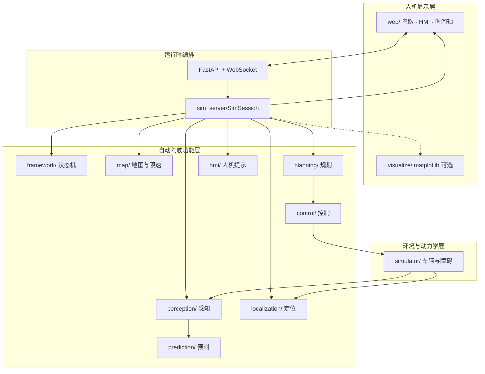

`SimSession` 以固定节拍调度各模块，并将结果序列化为 snapshot，经 WebSocket 推送至前端。

### 3.2 技术原理

量产自动驾驶软件规模较大，通常按感知、定位、预测、规划、控制、HMI 分层实现，以便：

- 独立替换某一层算法而不改动其余层接口；  
- 按层进行测试、定位缺陷与调节参数；  
- 明确数据契约（输入/输出字段）。

本工程为教学原型：模型与算法选取可解析、可调参的实现，参数集中于各模块 `config.py`。

### 3.3 三类时间与状态（勿混淆）

| 类别 | 含义 | 工程载体 |
|------|------|----------|
| 仿真时间 \(t\) | 场景内连续时间的离散采样 | `SimSession.sim_time`，每帧增加 `DT` |
| 会话状态 | 仿真是否推进 | `idle / running / paused / finished` |
| 功能状态（AD） | 自动驾驶功能启用层级 | `OFF / PASSIVE / STANDBY / ACTIVE / OVERRIDE` |

前端顶栏显示会话状态；HMI 面板显示功能状态。

### 3.4 核心代码逻辑：单帧处理流水线

实现位置：`sim_server/session.py` → `_advance_frame`。

```text
1. 按仿真时刻触发上电 / 自检，推进功能状态机（OFF→PASSIVE→STANDBY）
2. 更新脚本化动态障碍位姿
3. 激光雷达仿真、摄像头仿真 → 多传感器融合
4. 障碍物跟踪与短时轨迹预测
5. 路径密化；查询前方限速
6. 纵向规划得到目标车速 v_cmd（巡航 / ACC / 静态障碍 / 终点约束）
7. Pure Pursuit 计算纵向加速度 acc 与前轮转角 steer
8. 动力学积分：world.step(acc, steer)
9. EKF：控制量预测；按 GPS 周期进行位置更新
10. 处理激活挂起 / 车速越界退出等功能状态逻辑
11. 组装 snapshot（含 HMI、预瞄几何）→ 写入帧历史 → 推送前端
```

**位姿使用策略（本工程约定）**

| 用途 | 位姿来源 | 说明 |
|------|----------|------|
| 限速查询、纵向规划 | 估计位姿 `vehicle_est` | 贴近装车软件输入 |
| 横向 Pure Pursuit | 真值位姿 `vehicle` | 降低定位噪声引起的横向振荡，便于教学演示 |

### 3.5 相关数据接口：snapshot 顶层字段

| 字段 | 类型 | 含义 |
|------|------|------|
| `t` | float | 仿真时间（s） |
| `state` | str | 功能状态，如 `"STANDBY"` |
| `vehicle` | dict | 自车真值位姿与速度 |
| `vehicle_est` | dict | EKF 估计位姿与速度 |
| `waypoints` | list | 地图路线折线点 |
| `path` | list | 密化后跟踪路径 |
| `lookahead` | point\|null | 当前预瞄点 |
| `lookahead_path` | list | 沿路径至预瞄点的折线 |
| `preview_traj` | list | Pure Pursuit 圆弧预览点列 |
| `lookahead_dist` | float | 预瞄距离 \(L_d\)（m） |
| `lane_*` / `lane_markings` | geometry | 自车走廊车道标线 |
| `network_lane_markings` | geometry | 底图其余道路标线 |
| `obstacles` | list | 真值障碍矩形 |
| `fused` | list | 融合感知结果 |
| `predictions` | list | 预测轨迹 |
| `v_cmd` | float | 规划目标车速（m/s） |
| `steer` | float | 前轮转角（rad） |
| `speed_limit` | float\|null | 前方限速（m/s） |
| `acc` | dict\|null | ACC HUD：`d_gap, v_lead, source` |
| `route_links` | list | 路段几何与限速（可视化着色） |
| `hmi` | dict | 功能状态与提示列表 |
| `session_status` | str | 会话状态 |
| `view` | dict | 视图模式，如 heading-up |

### 3.6 推荐操作流程（Web）

1. 启动仿真会话（「开始」）。  
2. 等待功能状态进入 `STANDBY`（约 \(t \ge 2.5\) s）。  
3. 车速进入允许区间后请求激活；HMI 应提示「功能已激活」。  
4. 观察预瞄几何、ACC 与限速变化提示。  
5. 请求退出激活，或暂停后通过时间轴/`seek` 回看历史帧。  

---

## 4. 全局配置 `config/`

### 4.1 架构图

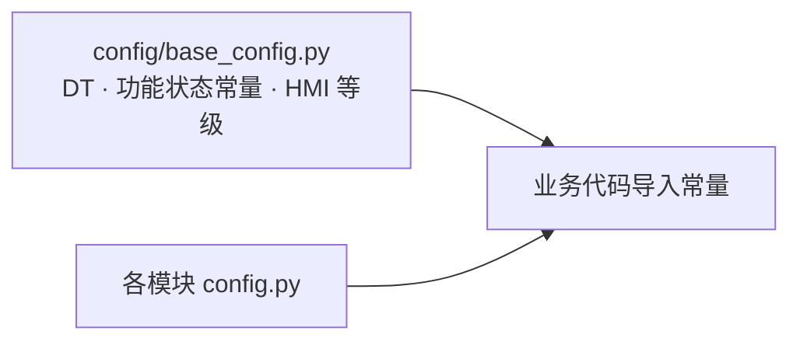

### 4.2 技术原理

将时间步长、状态枚举、告警等级等跨模块常量集中定义，避免魔法数散落于算法实现中，便于统一修改与审查。

### 4.3 核心代码逻辑

- 全局：`from config import DT, STATE_ACTIVE, HMI_INFO`  
- 模块级：`from control.config import LOOKAHEAD_MIN`  

### 4.4 相关数据接口及含义

| 符号 | 典型值 | 含义 |
|------|--------|------|
| `DT` | 0.05 | 仿真步长（s） |
| `STATE_*` | 字符串常量 | 功能状态枚举 |
| `HMI_*` | 字符串常量 | 告警等级枚举 |

---

## 5. 框架 `framework/`（状态机与事件总线）

### 5.1 架构图

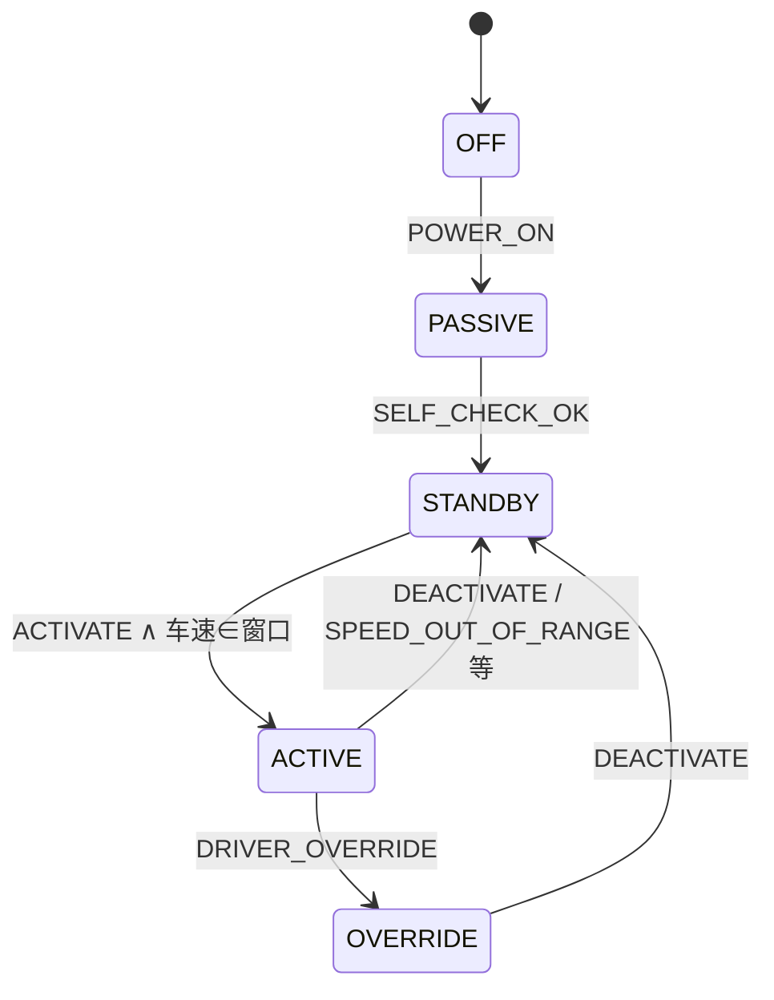


### 5.2 技术原理

**有限状态机（FSM）** 约束功能启用顺序：上电、自检、待机、驾驶员激活、退出或接管，避免由关机状态直接进入闭环控制。

**事件总线** 采用发布/订阅模式：发布方不依赖具体订阅方类型，降低模块耦合。HMI 订阅主题 `hmi_alert`。

**激活守卫条件**：车速须满足  
`ACTIVE_LOW_SPEED_THRESHOLD ≤ v ≤ ACTIVE_HIGH_SPEED_THRESHOLD`（默认 5–30 m/s，见 `framework/config.py`）。

### 5.3 核心代码逻辑

文件：`framework/state_machine.py`

1. `transit(event, vehicle_speed)`：依据当前状态、事件与守卫条件决定是否转移。  
2. `EV_ACTIVATE` 仅在 `STANDBY` 且车速合法时成功。  
3. `step(dt)`：在 `PASSIVE` 累计自检时间，超时标记自检失败。  

会话侧：

1. `request_activate()` 置位激活挂起标志并尝试转移。  
2. 每帧在 `STANDBY` 且挂起时重试 `EV_ACTIVATE`。  
3. `request_deactivate()` 触发 `EV_DEACTIVATE`。  

### 5.4 相关数据接口及含义

| 事件 | 含义 |
|------|------|
| `EV_POWER_ON` | 上电 |
| `EV_SELF_CHECK_OK` / `FAIL` | 自检通过 / 失败 |
| `EV_ACTIVATE` / `EV_DEACTIVATE` | 进入 / 退出 `ACTIVE` |
| `EV_SPEED_OUT_OF_RANGE` | 车速超出工作窗口 |
| `EV_DRIVER_OVERRIDE` | 驾驶员接管 |

状态变化回调载荷：`{"old_state","new_state"}`。  
常用主题：`state_change`、`hmi_alert`、`perception_update`。

---

## 6. 物理仿真 `simulator/`

### 6.1 架构图

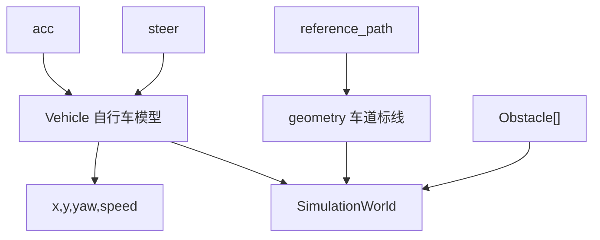

### 6.2 技术原理

采用平面运动学自行车模型：以纵向加速度与前轮转角为输入，对后轴中心状态 \((x,y,\psi,v)\) 进行积分。不建模轮胎侧偏等动力学细节，适于路径跟踪与纵向控制的教学验证。

参考路径定义为自车车道中心线；车道标线由 `LANE_WIDTH`、`NUM_LANES` 相对参考路径偏置生成。车身矩形由轴距、车长、后悬等几何参数由后轴中心展开。

### 6.3 核心代码逻辑

1. `Vehicle.step(acc, steer)`：输入限幅后积分速度与位姿。  
2. `SimulationWorld.step`：更新自车；动态障碍坐标由会话层按运动脚本写入。  
3. `get_lane_boundaries(path)`：生成可视化车道标线。  

### 6.4 相关数据接口及含义

**`Vehicle.get_state()`**

| 字段 | 含义 |
|------|------|
| `x`, `y` | 后轴中心世界坐标（m） |
| `yaw` | 航向（rad） |
| `speed` | 速度（m/s） |

**`simulator/config.py` 主要参数**

| 参数 | 典型值 | 含义 |
|------|--------|------|
| `WHEEL_BASE` | 2.7 | 轴距（m） |
| `MAX_ACC` / `MAX_DECEL` | 2 / -3 | 加、减速度限幅（m/s²） |
| `MAX_STEER_ANGLE` | 30° | 最大前轮转角 |
| `VEHICLE_LENGTH` / `WIDTH` | 4.8 / 1.96 | 车身尺寸（m） |
| `REAR_OVERHANG` | 1.0 | 后悬（m） |

**`Obstacle`**：`x,y,width,height`（轴对齐矩形中心与边长）。

---

## 7. 地图 `map/`

### 7.1 架构图

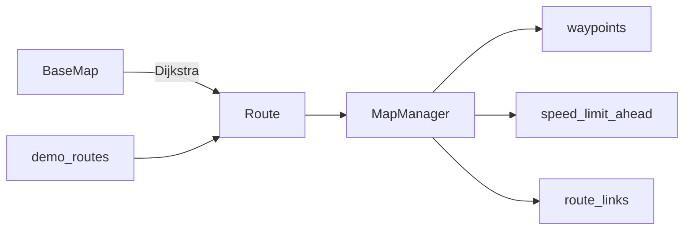

### 7.2 技术原理

- **Link**：几何折线 + 属性（限速、道路等级、机动类型等）。  
- **Route**：有序 Link 构成导航结果。  
- **弧长参数化**：支持路径投影与「前方前瞻距离内最低限速」查询。  
- **底图算路**：在 `BaseMap` 上对起终点求最短路并转换为 `Route`。  

### 7.3 核心代码逻辑

1. `MapManager.set_route(route)`：构建 waypoints 与弧长—限速表。  
2. `get_speed_limit_ahead(x,y)`：投影后在前瞻窗口内取最小限速。  
3. `POST /api/route/plan`：将算路结果写入场景草稿 links。  

### 7.4 相关数据接口及含义

| 字段 | 含义 |
|------|------|
| `link_id` | 路段标识 |
| `points` | 折线点列 |
| `speed_limit` | 路段限速（m/s） |
| `road_class` | `main` / `aux` |
| `maneuver` | `straight` / `left` / `right` 等 |

默认场景 `acc_highway`：前段限速约 12 m/s，后段约 8 m/s，用于触发限速切换 HMI。

---

## 8. 感知 `perception/`

### 8.1 架构图

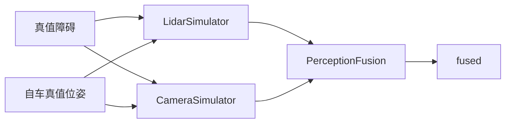

### 8.2 技术原理

仿真环境已知障碍真值。传感器仿真通过对观测施加最大作用距离、视场角、测量噪声与检测概率等约束，生成近似真实的检测输出。

融合阶段在匹配距离阈值内关联激光与视觉检测，合并为 `source="fusion"`，否则保留单传感器来源标记。

### 8.3 核心代码逻辑

1. `lidar.step` / `camera.step`  
2. `fusion.fuse(lidar_results, camera_results)`  
3. 发布 `perception_update`；结果供预测与规划使用  

### 8.4 相关数据接口及含义

| 字段 | 含义 |
|------|------|
| `obs_id` | 检测标识 |
| `x`, `y` | 障碍中心（m） |
| `width`, `height` | 尺寸（m） |
| `confidence` | 置信度 \([0,1]\) |
| `category` | 类别标签 |
| `source` | `fusion` / `lidar_only` / `camera_only` |

快照字段：`fused`。

---

## 9. 预测 `prediction/`

### 9.1 架构图


### 9.2 技术原理

采用恒速（CV）模型在短时域内外推目标轨迹，用于演示切入场景下的提前减速。该方法不涉及学习型轨迹预测网络。

### 9.3 核心代码逻辑

`ObstaclePredictor.step(detections, dt)`：

1. 检测与轨迹关联（距离门限）；  
2. 速度估计平滑；  
3. 生成未来采样点列 `trajectory`。  

### 9.4 相关数据接口及含义

| 字段 | 含义 |
|------|------|
| `obs_id` | 跟踪目标标识 |
| `vx`, `vy` | 速度估计（m/s） |
| `trajectory` | 未来位置点列 |
| `coasting` | 是否处于丢检外推 |

快照字段：`predictions`。

---

## 10. 定位 `localization/`

### 10.1 架构图

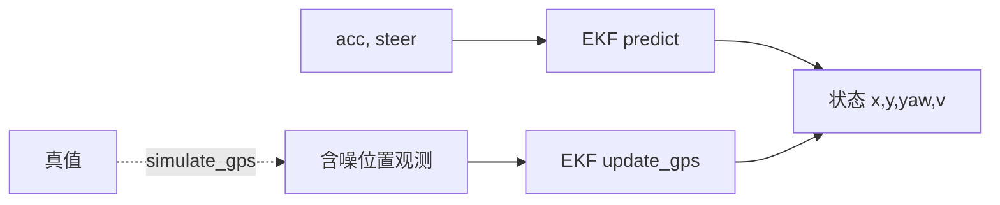

### 10.2 技术原理

EKF 状态取 \([x,y,\psi,v]^\top\)。每帧以控制输入做运动预测；按 `GPS_PERIOD` 注入由真值加噪声生成的位置观测并更新。本工程 GPS 更新以位置为主，避免错误航向修正引入横向振荡。

### 10.3 核心代码逻辑

1. `predict(acc, steer, DT)`  
2. 达到 GPS 周期 → `simulate_gps` → `update_gps`  
3. `get_state()` 写入 `vehicle_est`  

### 10.4 相关数据接口及含义

| 接口 / 参数 | 含义 |
|-------------|------|
| `get_state()` | 估计位姿字典 |
| `simulate_gps(true_state)` | 生成含噪 GPS |
| `GPS_PERIOD` | 更新周期（s） |
| `GPS_STD_XY` | 位置观测噪声标准差 |

---

## 11. 规划 `planning/`

### 11.1 架构图

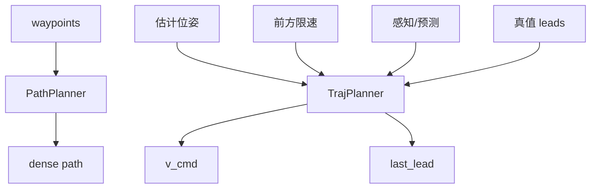

### 11.2 技术原理

本工程规划包含：

1. **路径密化**：为横向控制提供足够密度的参考点；  
2. **纵向目标速度生成**：在巡航速度、前方限速、ACC 跟驰、静态障碍减速与终点减速等约束中取更保守值。  

ACC 期望间距：

\[
d_{\mathrm{des}} = d_{\min} + t_{\mathrm{gap}} \cdot v_{\mathrm{ego}}
\]

保险杠净空由中心距扣除自车前悬伸出与前车半长得到。本车道门限采用点到路径折线的垂距（默认约 1.8 m）。

### 11.3 核心代码逻辑

1. `PathPlanner.plan(waypoints)` → `path`  
2. `TrajPlanner.plan(...)` → `v_cmd`，并更新 `last_lead`  

### 11.4 相关数据接口及含义

| 参数 / 字段 | 含义 |
|-------------|------|
| `vehicle_state` | 估计位姿 |
| `speed_limit` | 前方限速，可为 `None` |
| `leads` | 真值前车列表（教学增强） |
| `d_gap` | 保险杠净空（m） |
| `v_lead` | 前车速度（m/s） |
| `source` | 跟驰目标来源标记 |

| 配置 | 含义 |
|------|------|
| `CRUISE_SPEED` | 巡航速度 |
| `TIME_GAP` / `MIN_GAP` | 时距与最小净空 |
| `STOP_DISTANCE` | 紧急停车净空阈值 |
| `END_SLOW_DISTANCE` | 终点减速起始弧长 |

---

## 12. 控制 `control/`

### 12.1 架构图

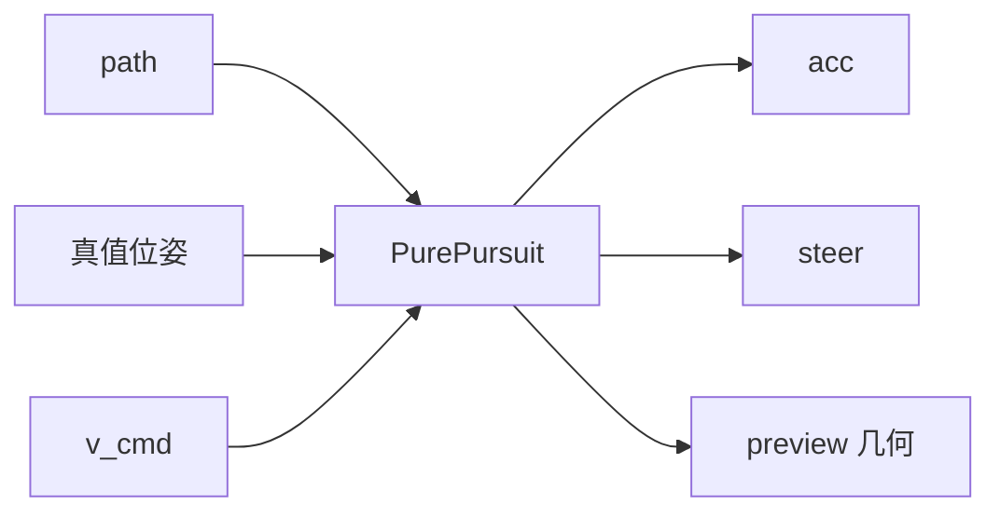

### 12.2 技术原理

**横向 — Pure Pursuit**  
在参考路径上选取预瞄点 \(T\)，预瞄距离  

\[
L_d = \mathrm{clip}(k_v \cdot v,\ L_{\min},\ L_{\max})
\]

假定自车以圆弧运动到达 \(T\)，由几何关系求解前轮转角 \(\delta\)。

**纵向 — 比例控制**  

\[
a = K_p (v_{\mathrm{cmd}} - v)
\]

再经加速度限幅。`STANDBY` 下可采用恒定 `STANDBY_ACC` 以较快进入可激活车速窗口。转角变化率限制用于抑制横向振荡。

### 12.3 核心代码逻辑

1. `compute(pose, path, target_speed=v_cmd)` → `(acc, steer)`  
2. `get_preview_trajectory(...)` → 路径预瞄折线、圆弧预览与预瞄点  
3. 施加 `MAX_STEER_RATE` 限制  

### 12.4 相关数据接口及含义

| 字段 | 含义 |
|------|------|
| `acc` | 纵向加速度指令（m/s²） |
| `steer` | 前轮转角（rad） |
| `lookahead_path` | 至预瞄点的路径折线 |
| `preview_traj` | 圆弧预览点列 |
| `lookahead_dist` | \(L_d\)（m） |

| 配置 | 含义 |
|------|------|
| `LOOKAHEAD_MIN/MAX/GAIN` | 预瞄距离随速参数 |
| `SPEED_KP` | 纵向比例增益 |
| `STANDBY_ACC` | 待机阶段加速度 |
| `MAX_STEER_RATE` | 转角变化率上限（rad/s） |

---

## 13. HMI `hmi/`

### 13.1 架构图

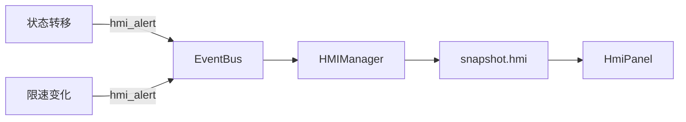

### 13.2 技术原理

HMI 向驾驶员呈现功能状态与事件提示。本工程重点事件：

| 事件 | 文案 | code |
|------|------|------|
| 进入 `ACTIVE` | 功能已激活 | `ad_activate` |
| 返回 `STANDBY` | 功能已退出 | `ad_exit` |
| 前方限速变化 | 限速切换：… | `speed_limit` |

其余状态转移使用 `state_change` 通用文案。

### 13.3 核心代码逻辑

1. 会话在状态/限速变化时 `publish("hmi_alert", ...)`  
2. `HMIManager` 将新告警插入列表头部，超过容量淘汰最旧项  
3. 每帧 `to_payload(ad_state)` 写入 snapshot  

### 13.4 相关数据接口及含义

**告警条目**

| 字段 | 含义 |
|------|------|
| `level` | 告警等级 |
| `msg` | 中文文案 |
| `code` | 事件类型编码 |
| `t` | 仿真时间戳（可选） |

**`snapshot.hmi`**

| 字段 | 含义 |
|------|------|
| `ad_state` | 当前功能状态 |
| `alerts` | 告警列表（新→旧） |
| `latest` | 最新告警 |
| `highest` | 当前最高告警等级 |

---

## 14. 编排与服务 `sim_server/`

### 14.1 架构图

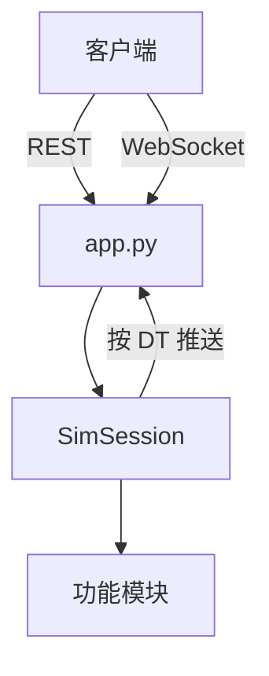

### 14.2 技术原理

计算与渲染分离：后端完成仿真步进；WebSocket 推送 snapshot；REST 提供会话控制、场景配置与算路接口。`SceneConfig` 描述路线、障碍、时长及可选底图绑定。

### 14.3 核心代码逻辑

| 方法 | 职责 |
|------|------|
| `start/pause/resume/reset` | 会话生命周期 |
| `step_once` | 运行态推进一帧 |
| `seek_frame` / `step_frame` | 历史帧检索与单步 |
| `request_activate/deactivate` | 功能激活/退出 |
| `status_payload` | 会话与功能状态摘要 |
| `_to_snapshot` | 帧数据序列化 |

`POST /api/control` 的 `action`：  
`start|pause|resume|reset|step_prev|step_next|seek|activate|deactivate`。

### 14.4 相关数据接口及含义

**`status_payload`**

| 字段 | 含义 |
|------|------|
| `status` | 会话状态 |
| `t` / `duration_s` | 当前时间 / 场景时长 |
| `frame_i` / `frame_n` / `frame_total` | 当前帧索引 / 已记录帧数 / 预期总帧数 |
| `scrubbing` | 是否处于历史回看 |
| `ad_state` | 功能状态 |
| `can_activate` / `can_deactivate` | 激活/退出可用性 |
| `ad_engage_pending` | 激活是否挂起 |

**障碍运动**

| 类型 | 含义 |
|------|------|
| 静态 | 固定 `x,y` |
| `linear` | 匀速 `vx,vy` |
| `scripted` | 关键帧插值 |

---

## 15. 前端 `web/`

### 15.1 架构图

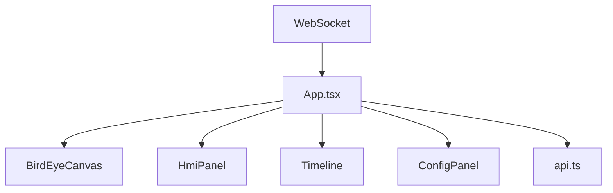

### 15.2 技术原理

- **Heading-up 鸟瞰**：自车朝向固定向上，旋转场景几何，便于观察横向跟踪误差。  
- **草稿与已应用配置分离**：编辑作用于 draft；开始/应用后写入会话。  
- **时间轴**：以场景总时长定标；检索范围限于已仿真帧。  

### 15.3 核心代码逻辑

1. 初始化拉取场景、预设、底图并建立 WebSocket。  
2. `type=frame` 更新 snapshot 并重绘。  
3. `type=status` 更新会话状态、时间轴与激活控件。  
4. 工具模式处理算路、路线编辑与障碍布置。  

### 15.4 相关数据接口及含义

类型定义见 `web/src/types.ts`，与后端 snapshot、`SceneConfig` 对齐。控制动作字符串同 §14。HMI 面板绑定 `snapshot.hmi` 与 `ad_state`。

---

## 16. CLI 可视化 `visualize/`

### 16.1 架构图


### 16.2 技术原理

基于 matplotlib 渲染与 Web 同类的鸟瞰信息。`ENABLE_VISUALIZE=False` 时使用空渲染器，适用于无界面测试。

### 16.3 核心代码逻辑

`create_renderer()` → 每帧 `update(snapshot)`。

### 16.4 相关数据接口及含义

输入为 §3.5 所述 snapshot；车辆与车道几何参数与 `simulator.config` 一致。

---

## 17. 端到端数据流示例

### 17.1 限速变化

```text
Route 中相邻 Link 限速不同
  → MapManager.get_speed_limit_ahead 输出变化
  → Session 检测差分并发布 speed_limit 类 HMI
  → TrajPlanner 在更严限速下降低 v_cmd
  → Pure Pursuit 纵向比例控制产生减速 acc
  → Vehicle 速度下降
  → snapshot 中 speed_limit / v_cmd / hmi / vehicle 更新并推送前端
```

### 17.2 功能激活

```text
客户端 action=activate
  → request_activate 置位挂起并尝试转移
  → 车速满足守卫条件时 EV_ACTIVATE 成功
  → STANDBY → ACTIVE，HMI 发布「功能已激活」
  → 纵向跟踪 v_cmd，横向 Pure Pursuit 跟踪 path
```

### 17.3 LCC / 拨杆变道 / AEB（2026-08-05）

```text
LaneMap.ego_lane 中心线链
  → PathPlanner 密化 → Pure Pursuit（LCC）

action=lane_change direction=left|right
  → 检查 ACTIVE / 虚线 / 邻道空闲
  → 过渡路径 smoothstep 混合两车道中心线
  → 横向误差收敛后提交 ego_lane_id

AEBController.evaluate(leads)
  → TTC / 净空分级：FCW 文言 → AEB 盖写 acc
  → 与 ACC 仲裁：min(acc_acc, acc_aeb)

鸟瞰 view.cam_yaw
  → 取自车道/道路中心线切向（非变道过渡 path）
  → 换道时自车横向移动，画面 heading 保持道路朝上
```

关键字段：`accel`（纵向加速度指令）、`view.cam_yaw`、`hmi.alerts`（含 `_sim_log` 事件）。

关键文件：`map/lane_map.py`、`map/demo_lane_maps.py`、`planning/lane_change.py`、`safety/aeb.py`。

---

## 18. 推荐学习路径

1. 运行 Web：`highway_lcc` 拨杆变道、`highway_aeb` 看 FCW/AEB。  
2. 阅读 §3.4，对照 `_advance_frame` 源码。  
3. 沿数据链：`LaneMap` → `lane_change` / LCC path → `planning` → `control` → `safety/aeb`。  
4. 调整 `TIME_GAP`、`FCW_TTC`、`AEB_TTC` 观察闭环。  
5. 结合状态机与 HMI code（激活 / 变道 / FCW / AEB）。  

---

## 19. 相关文档

| 文档 | 用途 |
|------|------|
| 本文 `docs/auto_sim_learning.md` | 模块学习：架构、原理、逻辑、接口与术语 |
| `README.md` | 环境与快速开始 |
| `HANDOFF.md` | 开发交接与后续任务 |
| `CHANGELOG.md` | 变更记录 |
| `docs/SUMMARY_*.md` | 专题/日报级开发笔记 |
| `docs/SUMMARY_2026-08-05_daily.md` | 2026-08-05 收工总览 |
| `docs/SUMMARY_2026-08-05_l2_p1.md` | LaneMap / LCC / 变道 / AEB |

---

*若接口字段发生变更，以 `sim_server/session.py` 中 `_to_snapshot` 与 `web/src/types.ts` 为准。*
